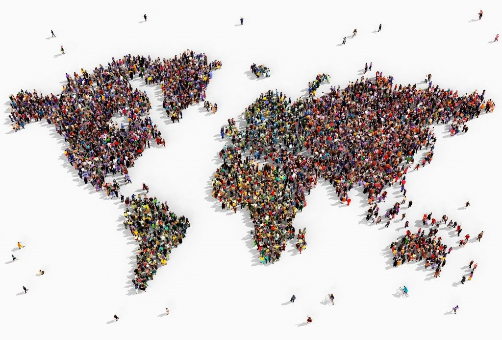

# DH101 Project

This is the repository for my Berkeley DH101 project under Professor Evan Muzzall during Summer 2020 Session A.

### Group Project Abstract

Human interpretation and contextualization are critical components of computational data analysis. Given that data are interpretable objects with inherently subjective processes of design, methodology, and representation, human biases and preexisting assumptions convolute notions of objectivity and accuracy. Through a collaborative process involving my classmates Urvi Guglani and Akshatha Muralidhar, our group project explores the limitations of digitial humanites with respect to implicit assumptions and biases within modern data practices. The long-term implications of our study reveal widespread misinterpretation of data, reduced credibility of data research, and the proliferation of algorithmic bias within complex sociotechnical systems in the future. To address these concerns, our findings suggest the institutional need for raising disciplinary standards within the digital humanities. An emphasis on peer collaboration, editorial stringency, and disciplinary judgement is necessary for promoting reliable interpretations of data and results in our datafied future.

**Sources**:    
"Critical Questions for Big Data", Dana Boyd and Kate Crawford     
"The Digital Humanities Debacle", Nan Z. Da    
"Defining Data for Humanists: Text, Artifact, Information, or Evidence?", Trevor Owens     
"Meaning and Mining: The Impact of Implicit Assumptions in Data Mining for the Humanities", D. Scuelly and B. M. Pasanek

### Individual Project Abstract

Human overpopulation is an ongoing socioeconomic and environmental concern that has the potential to result in exhaustion of natural resources, environmental degradation, climate change, rising unemployment, increased poverty, and wider income inequality. My individual project explores patterns of human growth and overpopulation in the 21st century using relevant computation tools and methods. Using fertility, mortality, international migration, and historical world population data, my project utilizes linear regression, logistic population modeling, and cohort-component modeling in order to generate population projections for the year 2100. The inital results indicate that the world population will continue to increase for the majority of the 21st century, with an expected average population of 10.96 billion. These findings raise significant questions regarding the sustainability of human populations in the future.

**Sources**:    
United Nations Department of Economic and Social Affairs, Population Dynamics       
History Database of the Global Environment (HYDE)         
Our World in Data (OWID)  